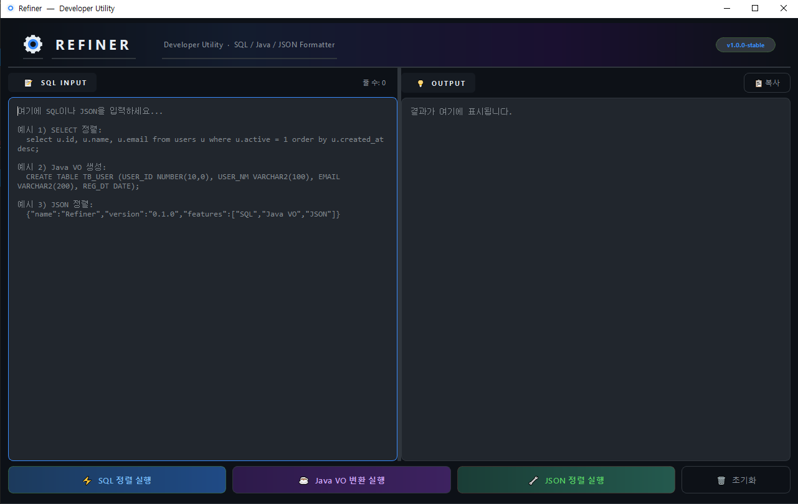

# Refiner

> 개발자를 위한 SQL & JSON 포매터 및 Java VO 자동 생성 유틸리티



**Refiner**는 가독성이 떨어지는 SQL과 JSON 데이터를 한눈에 보기 좋게 정렬해 주고, DDL을 기반으로 Java VO(Value Object) 클래스를 자동으로 작성해 주는 개발자 전용 생산성 도구입니다.

---

## ✨ 주요 기능 (Features)

### 1. SQL 포매터 (SQL Formatter)
- 한 줄로 길게 작성된 쿼리를 표준 관례에 맞춰 탭(Tab) 들여쓰기 기반으로 깔끔하게 정렬합니다.
- `SELECT`, `FROM`, `WHERE` 등 주요 키워드 기준의 줄바꿈은 물론, 서브쿼리의 재귀적인 들여쓰기까지 지원합니다.
- SQL 구문 강조(Syntax Highlighting) 기능을 통해 코드의 가독성을 극대화합니다.

### 2. Java VO 자동 생성 (Java VO Generator)
- `CREATE TABLE` 구문을 분석하여 표준 Java VO 클래스 코드를 즉시 생성합니다.
- **Getter/Setter 자동 생성**: 별도의 라이브러리 없이도 바로 사용할 수 있도록 필드별 Getter와 Setter 메서드를 포함합니다.
- **Oracle → Java 데이터 타입 자동 매핑**: NUMBER, DATE, RAW 등의 타입을 실무 관례에 맞춰 변환합니다. 특히 NUMBER 타입은 `NOT NULL` 여부에 따라 `int`와 `Integer`를 구분하여 생성합니다.
- **Javadoc 자동 연동**: `COMMENT ON COLUMN` 구문이 있을 경우, 해당 코멘트를 추출하여 Java 필드의 Javadoc 주석으로 추가합니다.

### 3. JSON 포매터 (JSON Formatter)
- 압축되거나 구조가 불분명한 JSON 데이터를 4칸 들여쓰기 형태의 보기 좋은 구조로 변환합니다.
- JSON Key, String, Number, Boolean 등 각 요소에 전용 색상 테마를 적용해 구조를 쉽게 파악할 수 있도록 돕습니다.

---

## 🛠 기술 스택 (Tech Stack)

- **Language**: Python 3.12+
- **GUI Framework**: PyQt6
- **Libraries**:
    - `sqlparse`: SQL 토큰 분석 및 초기 파싱
    - `pyperclip`: 클립보드 복사 연동
    - `re`: 커스텀 파싱 및 구문 강조용 정규표현식 처리
- **Icons**: ⚙ (Gears) Custom Icon

---

## 📁 프로젝트 구조 (Project Structure)

```text
refiner/
├── main.py                 # 앱 초기화 및 GUI 레이아웃 구성 (PyQt6)
├── requirements.txt        # 의존성 패키지 목록
├── core/                   # 핵심 변환 로직 모듈
│   ├── sql_formatter.py    # SQL 쿼리 정렬 및 인덴트 처리 로직
│   ├── java_vo_generator.py# DDL 분석 및 Java VO 문자열 생성 로직
│   └── json_formatter.py   # JSON 데이터 구조화 및 예외 처리 로직
├── ui/                     # UI 컴포넌트 및 스타일 코드
│   ├── theme.py            # 다크 테마 색상 및 CSS 스타일 정의
│   └── highlighters.py     # 언어별(SQL, Java, JSON) 구문 하이라이터 구현
├── assets/                 # 정적 리소스 파일
│   └── images/
│       ├── icon.ico        # 앱 실행 파일용 아이콘 (256px)
│       └── main_screenshot.png # README 예시 스크린샷
├── scripts/                # 유틸리티 및 관리용 스크립트
│   └── build.bat           # 원클릭 PyInstaller 빌드 스크립트
└── README.md
```

---

## 🚀 사용자 가이드 (Usage Guide)

### ⌨️ 단축키 (Shortcuts)

| 기능 | 단축키 | 설명 |
|--------|------|------|
| **SQL 정렬** | `Ctrl + Enter` | 입력된 SQL 문을 보기 좋게 정렬 |
| **Java VO 변환** | `Ctrl + Shift + Enter` | 입력된 DDL을 Java 클래스 코드로 변환 |
| **JSON 정렬** | `Alt + J` | 입력된 JSON 데이터를 구조화하여 정렬 |
| **결과 복사** | `Ctrl + Shift + C` | 출력창의 결과물을 클립보드로 복사 |
| **입력 초기화** | `Ctrl + Delete` | 입력창과 출력창의 텍스트 모두 지우기 |

---

## 💻 개발자 가이드 (Build & Run)

### 1. 환경 설정 및 프로그램 실행
```bash
# 가상환경 생성 및 활성화
python -m venv venv
.\venv\Scripts\activate

# 의존성 패키지 설치
pip install -r requirements.txt

# 프로그램 실행
python main.py
```

### 2. 단일 실행 파일(EXE) 빌드
제공된 `scripts\build.bat` 배치 파일을 실행하면, 코드와 리소스가 포함된 단일 실행 파일이 간편하게 생성됩니다.
- 빌드 결과물 경로: `dist\Refiner.exe`

---

## 🗺️ Oracle → Java 타입 매핑 참조 테이블

| Oracle 데이터 타입 | Java 타입 | 비고 |
|--------------------|-----------|------|
| `VARCHAR2`, `CHAR`, `CLOB` | `String` | 문자열 계열 |
| `NUMBER`, `NUMERIC`, `INT` | **`int`** | `NOT NULL` 제약 조건이 있는 경우 |
| `NUMBER`, `NUMERIC`, `INT` | **`Integer`** | `NULL` 허용인 경우 (Wrapper class) |
| `DATE`, `TIMESTAMP` | `String` | 실무 편의를 위해 String으로 매핑 |
| `RAW` | `String` | 실무 편의를 위해 String으로 매핑 |
| `BLOB`, `LONG RAW` | `byte[]` | 이진 데이터 계열 |
| `FLOAT`, `DOUBLE` | `Double` | 실수 계열 |
